به نام خدا

**پروژه درس تحلیل ها و سیستم های داده های حجیم**

دانشجو :

پریسا مبارک

شماره دانشجویی :

40211415006

استاد مربوطه :

دکتر عبدالرضا رشنو

تیرماه 1403

در این پروژه دو قسمت داریم:

1. با استفاده از fastapi یک api ایجاد کنیم که یک تصویر را از ورودی بگیرد و با استفاده از مدل cnn برچسب تصویر را برگرداند.
1. با استفاده از fastapi یک api ایجاد کنیم که یک تصویر را از ورودی بگیرد و با استفاده از مدل fcn تصویر بخش بندی شده را برگرداند.

هدف این هست که در ادامه موارد زیر را انجام دهیم:

1. پروژه را داکرایز کرده و کانتینرهای لازم برای اجرای پروژه را ایجاد کنیم.
1. از طریق بستر Github فایل های داکرایز شده را از IDE به repository خود push کنیم.
1. یک سرور مجاز ی را برای بازه کوتاهی اجاره کنیم ، کانفیگ کنیم، نیازمندی ها را روی آن نصب کنیم، محتوا ی repository خود را از Github به سرور clone کنیم.
1. کانتینرها را در سرور اجرا کنیم تا همه API ها بصورت عمومی در دسترس قرار گیرند.
1. گزارشی از جزئیات همه مراحل فوق به همراه عکس هر مرحله آماده کرده و در فایل ReadMe  قراردهیم.

**بخش اول: api نویسی**

**فایل main.py :**

در این کد، یک اپلیکیشن FastAPI ساخته می‌شود و دو Router  از ماژول‌های CNN  و FCN  به آن اضافه می‌شود. این ساختار به ما این امکان را می‌دهد که مسیرهای مختلف API را به صورت جداگانه مدیریت کنیم و در نهایت همه‌ی این مسیرها را به یک اپلیکیشن اصلی اضافه کنیم.

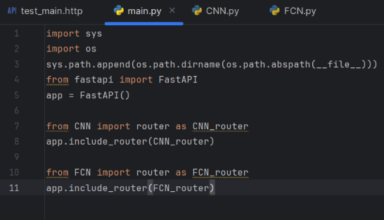

**فایل cnn.py :**

در این  قسمت میخواهیم یک api ایجاد کنیم که یک تصویر را از ورودی بگیرد و برچسب تصویر را به عنوان خروجی برگرداند. برای اینکار از یک مدل cnn استفاده میکنیم. کد مربوط به مدل cnn در سایت colab موجود میباشد در ادامه توضیحاتی درمورد چگونگی استفاده از این مدل و آموزش مدل و سایر بخش های مربوط به مدل cnn میدهم.

` `ابتدا کتابخانه های لازم را وارد میکنیم و سپس نام کلاس ها را مشخص میکنیم:

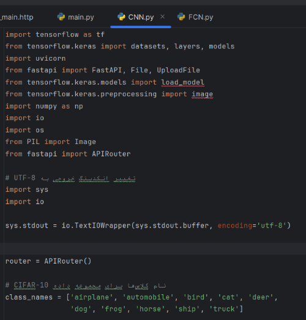

در مرحله بعد یک تابع برای آموزش و ذخیره مدل ایجاد میکنیم:

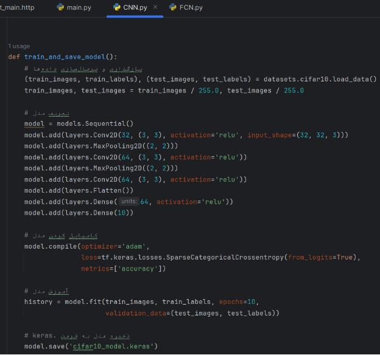

سپس یک تابع برای بارگذاری مدل آموزش داده شده(که آن را در یک فایل ذخیره کرده بودیم) مینویسیم:

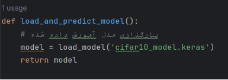

همچنین  یک شرط برای اینکه مدل فقط یک بار آموزش ببیند و در اجراهای بعدی فقط تست انجام شود میگذاریم.

در ادامه تابعی که برای بارگذاری مدل آموزش دیده شده نوشته بودیم را فراخوانی میکنیم.

سپس یک تابع برای پردازش تصویر مینویسیم. در این تابع تصویر بارگذاری‌شده به ابعاد (32, 32) تغییر اندازه داده می‌شود و سپس تصویر به آرایه تبدیل شده و نرمال‌سازی می‌شود:

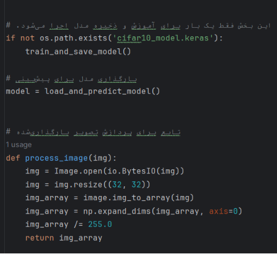

حال یک api مینویسیم که تصویر را به عنوان ورودی بگیرد و آن را بخواند و با استفاده از تابعی که از قبل تعریف کرده بودیم تصویر را پردازش کند و سپس یک پیشبینی با استفاده از مدل انجام دهد و اندیس بیشترین احتمال را برگرداند. این اندیس در واقع شماره کلاسی است که مدل به عنوان برچسب تصویر پیشبینی کرده است. بنابراین برچسب تصویر به عنوان خروجی api برگردانده میشود:

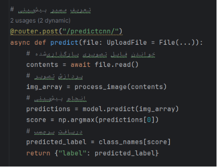

حال هر تصویری که در اینسومنیا به عنوان ورودی بدهیم ، برچسب تصویر به ما داده میشود به عنوان مثال اگر تصویر پرنده را به عنوان ورودی بدهیم:

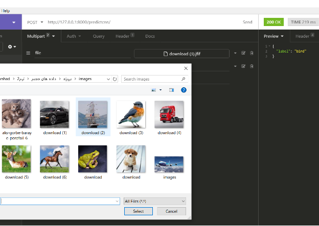

**فایل fcn.py :**

ابتدا کتابخانه های لازم را وارد میکنیم:

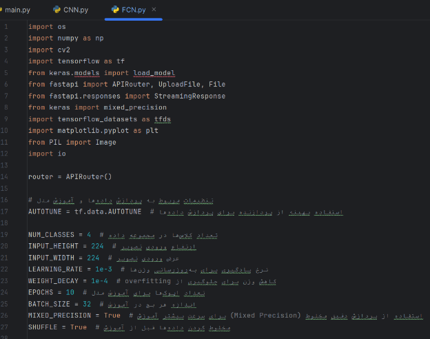

کد زیر تنظیماتی را اعمال می‌کند که باعث می‌شود مدل سریع‌تر و با مصرف حافظه کمتر آموزش ببیند:

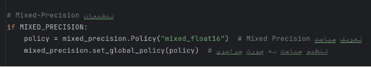

تابع train\_and\_save\_model مدل را آموزش و ذخیره میکند. در این تابع توابعی تعریف شده که هرکدام وظیفه خاصی دارند. این تابع کارهای زیر را انجام می‌دهد:

**بارگذاری و تقسیم داده‌ها:** مجموعه داده‌های "oxford\_iiit\_pet" را بارگذاری کرده و به مجموعه‌های آموزشی، اعتبارسنجی و آزمایشی تقسیم می‌کند.

**پیش‌پردازش داده‌ها:** تصاویر و ماسک‌ها را به اندازه 224 در 224  تغییر می‌دهد و آن‌ها را پیش‌پردازش می‌کند.

**تعریف مدل:** یک مدل مبتنی بر VGG19 تعریف می‌کند که خروجی‌های مختلف لایه‌های آن را استخراج می‌کند.

**افزودن لایه‌های جدید:** لایه‌های Dense به Conv2D تبدیل شده و لایه‌های جدیدی برای پیش‌بینی ماسک اضافه می‌شود.

**تنظیم بهینه‌ساز و تابع خسارت:** از AdamW به عنوان بهینه‌ساز و SparseCategoricalCrossentropy  به عنوان تابع خسارت استفاده می‌کند.

**آموزش مدل:** مدل را با داده‌های آموزشی آموزش می‌دهد.

**ذخیره مدل:** مدل آموزش دیده را در فایل "fcn32s\_model.h5" ذخیره می‌کند :

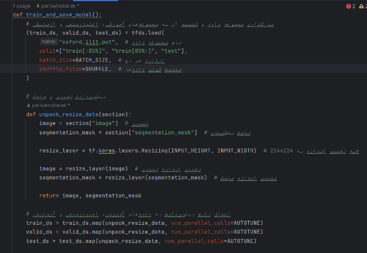

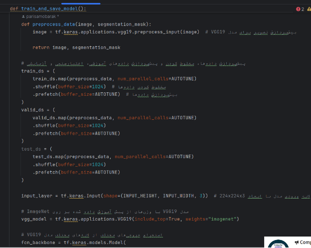

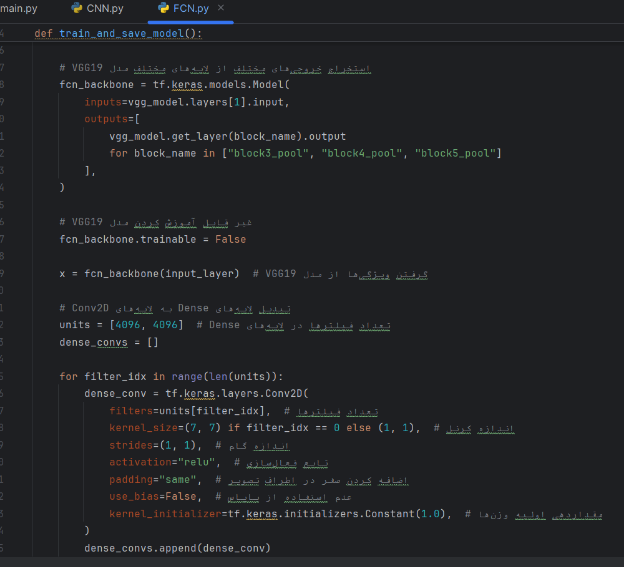

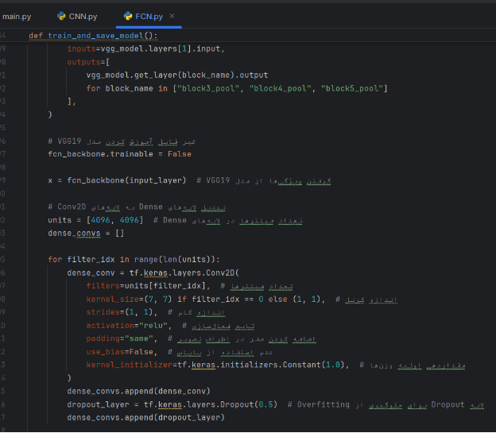

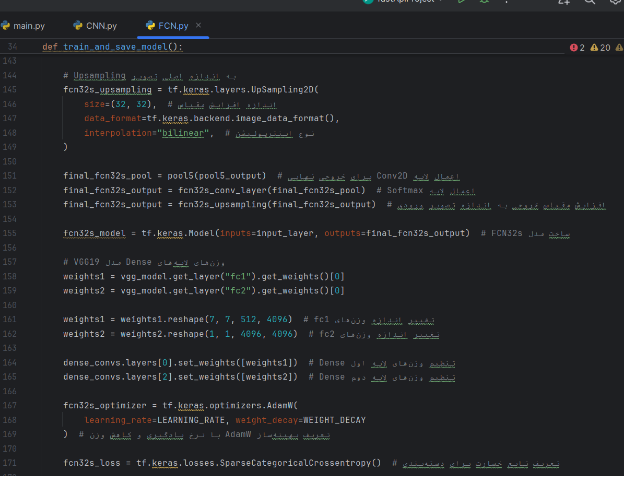

تابع load\_and\_model وظیفه بارگذاری مدل آموزش دیده شده را برعهده دارد.

` `در ادامه یک شرط وجود دارد که بررسی میکند مدل فقط یک بار آموزش ببیند.

` `در نهایت مدل آموزش دیده شده را برای پیش بینی (برای تصاویر جدید) بارگذاری میکنیم.

در تابع preprocess\_image  نیز پیش پردازش تصویر ورودی انجام میشود:

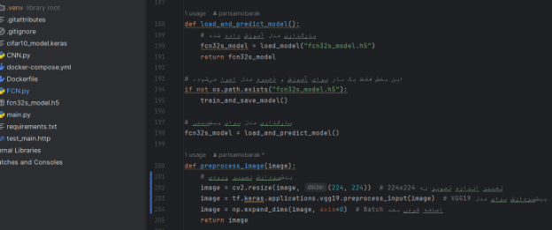

در تابع predict\_mask نیز پیش بینی ماسک بخش بندی بااستفاده از مدل انجام میشود و در تابع بعدی ماسک بخش بندی به تصویر رنگی تبدیل میشود:

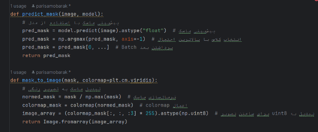

در نهایت یه api مینویسیم که یک تصویر را از ورودی بگیرد و تصویر بخش بندی شده را به عنوان خروجی بازگرداند:

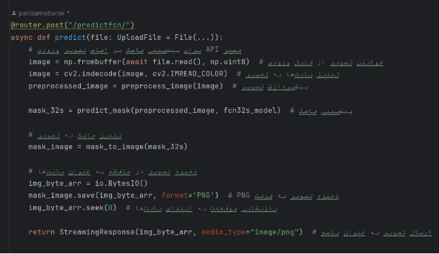

خروجی:

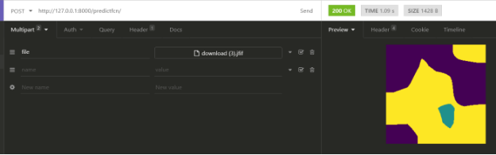

**بخش دوم: داکرایز کردن**

همانند پروژه قبل برای داکرایز کردن فایل داکرفایل و داکر کمپوز و فایل نیازمندی ها را ایجاد میکنیم. مطابق تصاویر زیر:

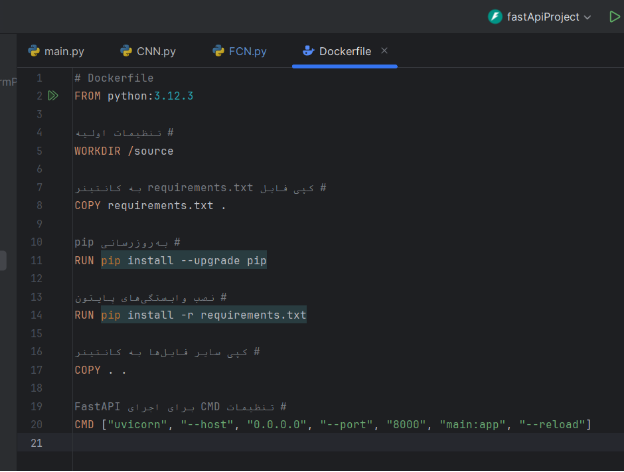

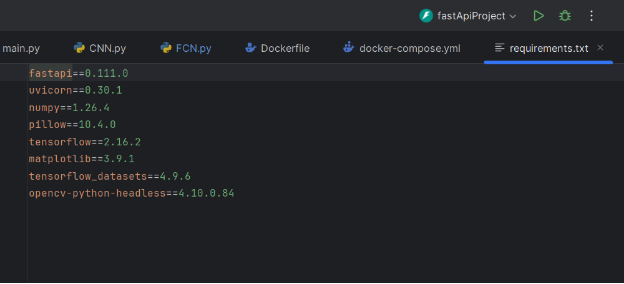

سپس مطابق تصویر زیر و همانند پروژه قبل دستور اجرای کانتینرها را میزنیم و پروژه داکرایز میشود:

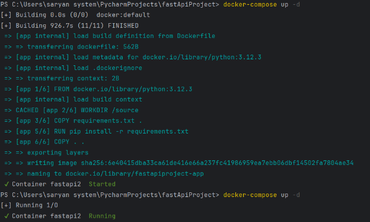

همانند دستورات تصویر زیر میتوانیم ایمیج ها و کانتینرها را مشاهده کنیم:

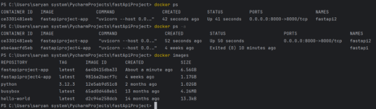

حال میتوانیم بدون ران کردن پروژه در پایچارم، در اینسومنیا پروژه داکرایز شده را تست کنیم.تصاویر زیر نشان میدهد که پروژه به خوبی داکرایز شده است:

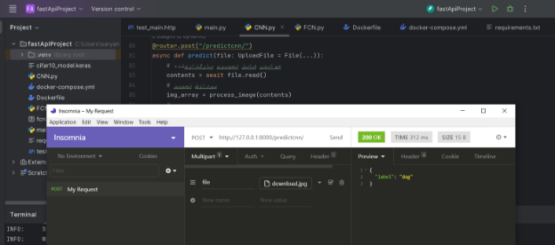

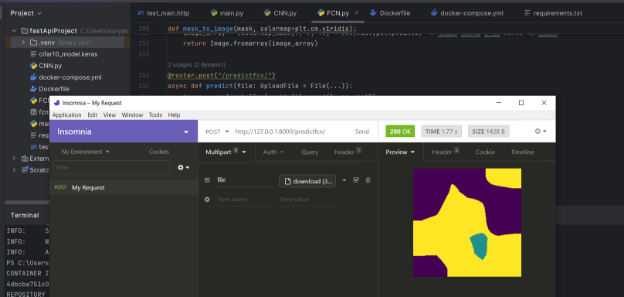

**بخش سوم: گیت**

در این قسمت میخواهیم پروژه را در ریپازیتوری خود پوش کنیم. برای این کار یک ریپازیتوری ایجاد میکنیم و سپس آدرس آن را کپی میکنیم :

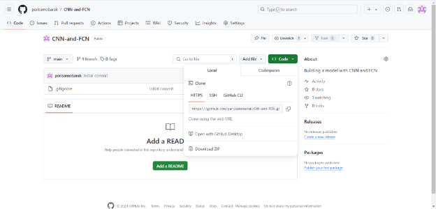

با استفاده از دستورات زیر پروژه را واردگیت میکنیم. لازم به ذکر است که پس از ایجاد پوشه گیت در کنار فایل های پروژه باید تمامی فایل ها را وارد آن پوشه کنیم:

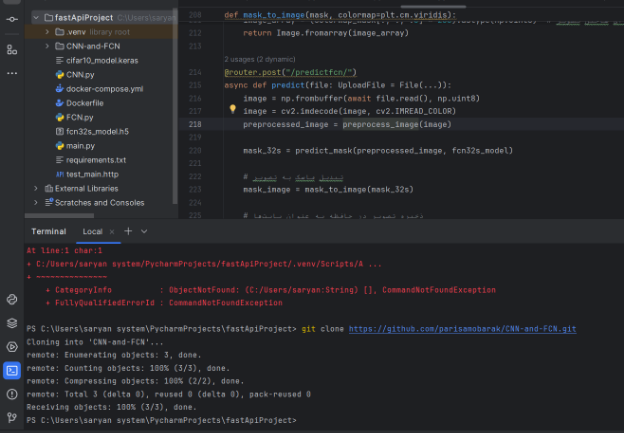

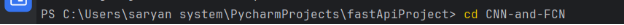

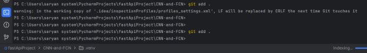

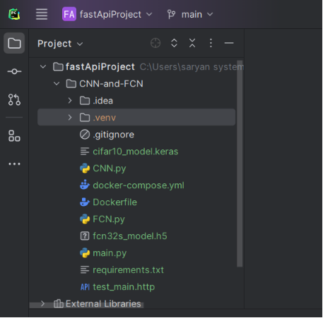

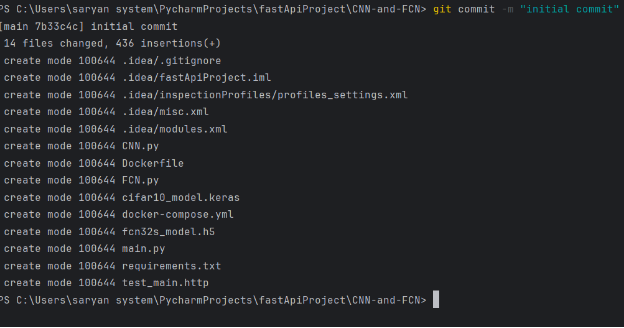

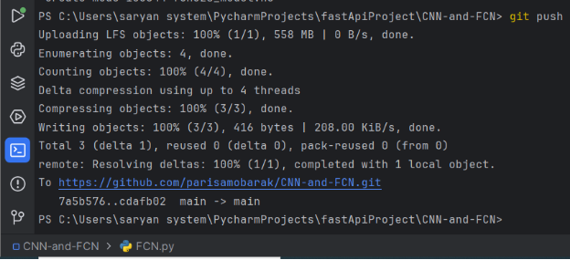

حال پروژه در مخزن گیتهاب پوش شده است. با زدن بر روی لینک بالا میتوانیم وارد محیط ریپازیتوری خود شویم:

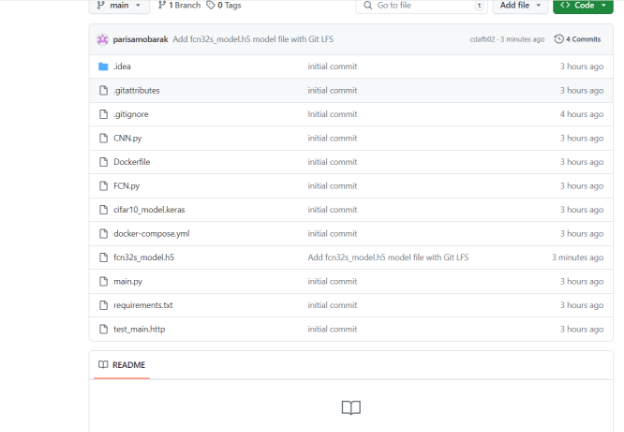

**بخش چهارم: سرور**

در این قسمت میخواهیم پروژه داکرایز شده را روی سرور اجرا کنیم. برای این کار یک codespace جدید ایجاد میکنیم و ریپازیتوری خود را انتخاب میکنیم:

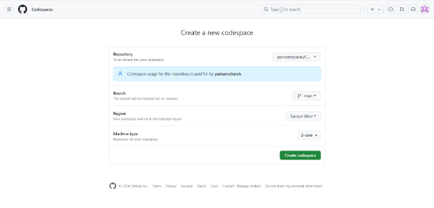

سپس دستور ایجاد و اجرای کانتینرها را میزنیم و پروژه داکرایز میشود:

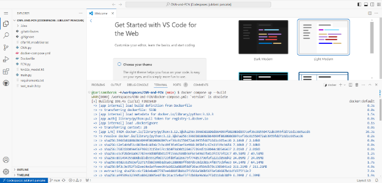

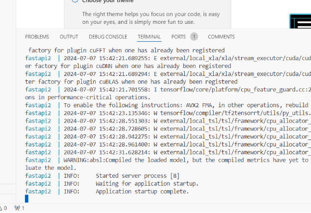

حال از قسمت port لینک داده شده را کپی میکنیم:

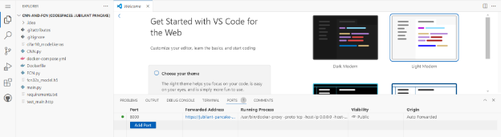

و اگر این لینک را ئر مرورگر اجرا کنیم و انتهای آن docs بگذاریم وارد داکیومنت پروژه میشویم:

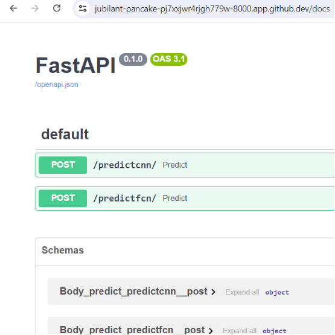

همچنین میتوانیم لینک داده شده را در اینسومنیا تست کنیم و مشاهده میکنیم که کدها به درستی روی سرور اجرا میشوند:

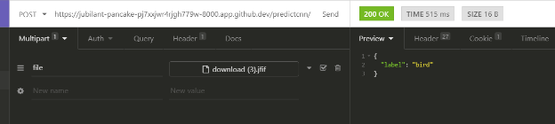

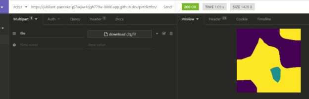

